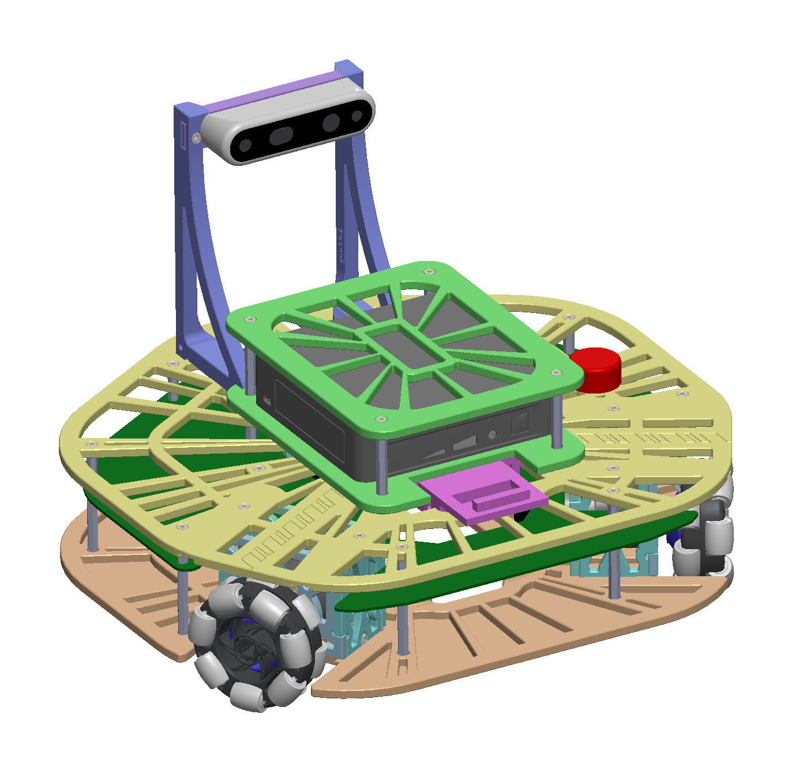

# robotont-mechanics

This repository contains models of mechanical parts of Robotont.
The latest release of Robotont is gen3.0.
Gen 3 is developed in SolidWorks (Student version), but a STEP assembly is also provided for modeling, as well as 3MF files for 3D-printing.

## Chassis overview

The main chassis is divided into 5 modules:

+ Frame module
+ Motor module
+ Camera module
+ Computer module
+ Battery module

## Production

To reproduce Robotont, production files are provided in [production](main-chassis/production/) folder.
The 3MF files contain the print settings optimised for Prusa MK3S, as well as the grouping of parts for printing.

To develop and change Robotont, SolidWorks model files are provided, along with STEP for use with other modeling software.

## Getting started

Print the calibration parts in the [calibration.3mf print project](main-chassis/production/3mf/).
If the two halves fit together and come apart easily, there are no issues with elephant foot and all surfaces are printed cleanly, proceed with printing out all the other print projects in the [3mf folder](main-chassis/production/3mf/).
If there are issues, tune the 3D-printer settings until the calibration piece is printed well, then apply the settings to all of the print projects.
